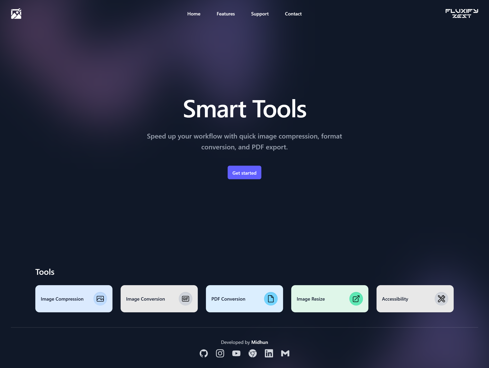
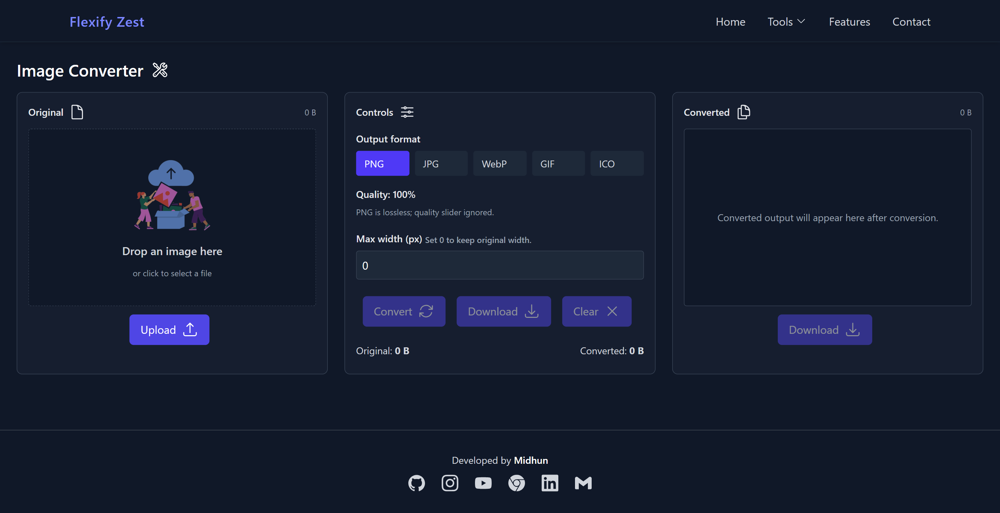
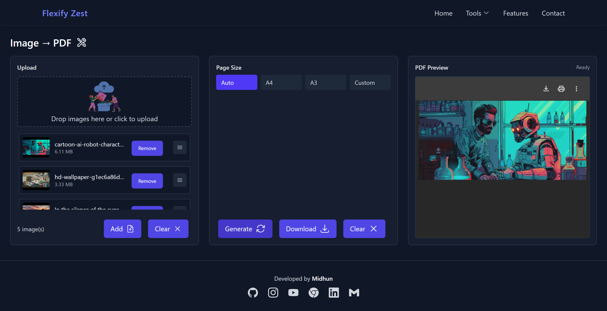

# Fluxify Zest — Image & PDF Utility



**Live Demo:** [https://fluxify-zest.web.app](https://fluxify-zest.web.app)

---

## About

Fluxify Zest is a lightweight utility app for converting, compressing, and manipulating images and PDFs. It provides a simple, fast interface for common tasks like image format conversion, batch compression, and basic PDF operations.

The app is built with privacy in mind — all processing happens locally on the user's device and no files are stored or transmitted to external servers.

---

## Features

* Image conversion between common formats (PNG, JPG, WEBP, etc.)
* Image compression (single & batch)
* PDF tools: merge, split, convert images to PDF
* Drag & drop or file-picker upload support
* Preview of input and output files
* Local processing — **no data stored or shared**

---

## Privacy

**Privacy First.**

* No files are uploaded to any server.
* No user data, file metadata, or usage logs are stored.
* All processing occurs on the user's device (in-browser/local), giving you full control over your files.

---

## Screenshots

* `screenshots/home_page.png` — Main dashboard


* `screenshots/image_convert.png` — Image conversion UI



* `screenshots/image_compress.png` — Compression options


* `screenshots/img_pdf.png` — Image to PDF Conversion



---

## Quick Start (for developers)

1. Clone the repository:

```bash
git clone https://github.com/vsmidhun21/utility_app.git
cd utility_app
```

2. Install dependencies (example using npm):

```bash
npm install
```

3. Run locally:

```bash
npm start
```

4. Build for production:

```bash
npm run build
```

---

## Deployment

This project is hosted on Firebase Hosting (or similar). Your live demo is available at: [https://fluxify-zest.web.app](https://fluxify-zest.web.app)

If you want to redeploy:

```bash
# install firebase tools if not already installed
npm install -g firebase-tools

# login and deploy
firebase login
firebase init hosting
firebase deploy --only hosting
```

---

## Usage

1. Open the app in your browser (or run locally).
2. Select image(s) or PDF(s) using drag & drop or the file picker.
3. Choose the operation (Convert, Compress, Merge, Split).
4. Preview the output and download — everything runs locally.

---

## File Structure (suggested)

```
fluxify-zest/
├─ public/
│  ├─ index.html
│  └─ ...
├─ src/
│  ├─ components/
│  ├─ utils/
│  └─ App.js
├─ screenshots/
│  ├─ overview.png
│  ├─ convert.png
│  ├─ compress.png
│  └─ pdf-tools.png
├─ README.md
└─ package.json
```

---

## Contributing

Contributions, issues, and feature requests are welcome. Please open an issue or submit a pull request on the repository.

---

## License

This project is released under the MIT License. See `LICENSE` for details.

---

## Contact

Created by Midhun

* **Email:** [midhun21@zohomail.in](mailto:midhun21@zohomail.in)
* **Portfolio:** [https://vsmidhun21.github.io/](https://vsmidhun21.github.io)
* **LinkedIn:** [https://www.linkedin.com/in/midhun-v-s/](https://www.linkedin.com/in/midhun-v-s)
* **Instagram:** [https://instagram.com/midhun_v_s_](https://instagram.com/midhun_v_s_)

